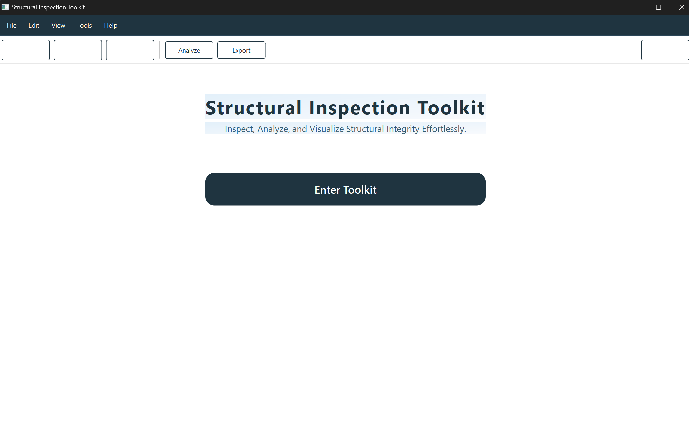
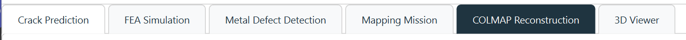
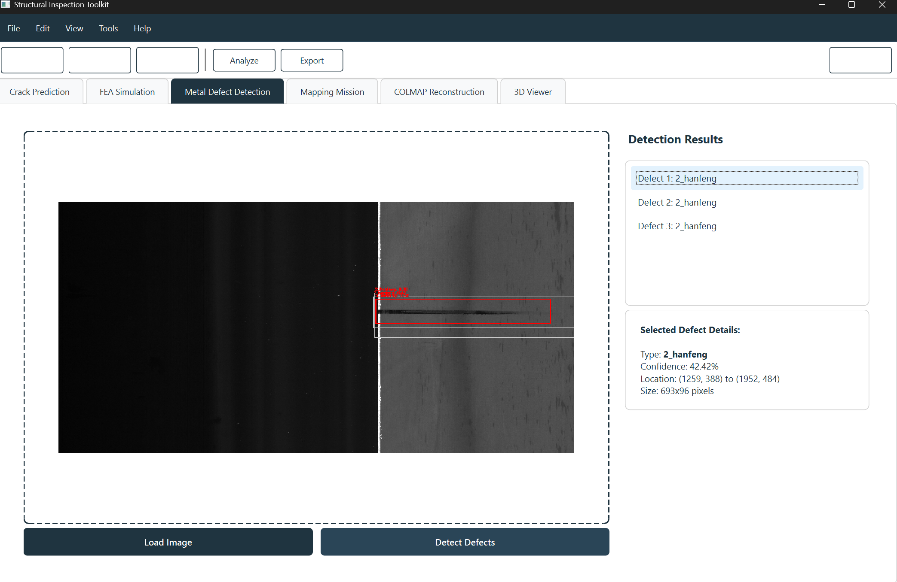

# Structural Inspection Toolkit

**Inspect, Analyze, and Visualize Structural Integrity Effortlessly.**

The **Structural Inspection Toolkit** is a desktop application for engineers and researchers to process drone / camera imagery, detect surface defects, and run reconstruction workflows from a single interface. It bundles crack analysis, metal defect detection, mapping and COLMAP 3D reconstruction into one unified PyQt-based toolkit.

---

## Table of Contents

- [Features](#features)
  - [Landing Screen](#landing-screen)
  - [Crack Prediction](#crack-prediction)
  - [Metal Defect Detection](#metal-defect-detection)
  - [COLMAP Reconstruction](#colmap-reconstruction)
  - [FEA Simulation (WIP)](#fea-simulation-wip)
  - [Mapping Mission (WIP)](#mapping-mission-wip)
  - [3D Viewer (WIP)](#3d-viewer-wip)
- [Requirements](#requirements)
- [Installation](#installation)
- [How to Run](#how-to-run)
- [Reconfiguring File Locations](#reconfiguring-file-locations)
- [Repository Structure](#repository-structure)
- [Planned Improvements](#planned-improvements)
- [License](#license)

---

## Features

### Landing Screen



The home screen gives a clean entry point into the toolkit:

- Project title and tagline.
- Top menu with **File**, **Edit**, **View**, **Tools**, and **Help**.
- Global buttons such as **Analyze** and **Export**.
- A central **Enter Toolkit** CTA that opens the main tabbed interface.

---

### Main Modules



The toolkit is organized into dedicated tabs:

- **Crack Prediction**
- **FEA Simulation**
- **Metal Defect Detection**
- **Mapping Mission**
- **COLMAP Reconstruction**
- **3D Viewer**

Each tab encapsulates a separate workflow while sharing a consistent UI layout.

---

### Crack Prediction


The **Crack Prediction** tab focuses on masonry and concrete crack analysis:

- Load inspection images via **Load Image**.
- Run crack detection using **Analyze Crack**.
- Visual overlay of the detected crack path on the original image.
- Quantitative metrics in the **Crack Analysis Results** panel:
  - **Crack Area**
  - **Crack Length** (in pixels and approximate millimeters)
  - **Mean Width**
  - **Max Width**
  - **Severity** level (e.g., *Moderate*)

This module is meant to make it easy to quickly assess whether a crack is minor or requires urgent attention.

---

### Metal Defect Detection



The **Metal Defect Detection** tab targets defect detection in metallic components:

- Load a metal surface image with **Load Image**.
- Run deep-learning–based detection using **Detect Defects**.
- Bounding boxes with class labels are drawn on the image (e.g., `2_hanfeng` in the screenshot).
- The **Detection Results** list shows all detected defects.
- The **Selected Defect Details** panel provides:
  - Defect **Type**
  - **Confidence**
  - **Location** (bounding box coordinates)
  - **Size** (bounding box dimensions in pixels)

Engineers can quickly identify, inspect, and document surface defects on metal sheets, beams, or plates.

---

### COLMAP Reconstruction


The **COLMAP Reconstruction** tab wraps a full SfM/MVS pipeline around COLMAP:

- Choose your **input image folder** (e.g., drone captures) with **Select Images**.
- Choose an **output folder** for COLMAP databases, sparse/dense models, and meshes via **Select Output**.
- Choose a **Mode**:
  - `Automatic Reconstruction`
  - `Feature Extraction Only`
  - `Custom Pipeline`
- Select a **Matcher** (e.g., `Exhaustive`).
- Run the full pipeline with **Run COLMAP**.
- Load an existing model via **Load Model**.
- Export a point cloud/mesh with **Export PLY**.
- A **Progress** bar and **Log Output** panel track the reconstruction steps and any COLMAP messages.

This module is designed to integrate seamlessly with the Mapping and 3D Viewer tabs for end-to-end inspection from images to 3D models.

---

### FEA Simulation (WIP)

The **FEA Simulation** tab is reserved for coupling structural simulations with detected damage:

- Intended for linking crack / defect maps to FEA or phase-field solvers.
- Will allow sending processed geometry / masks to external solvers and visualizing stress or damage fields.
- Currently under active development.

---

### Mapping Mission (WIP)

The **Mapping Mission** tab is reserved for mission-level planning and data management:

- Conceptually intended for:
  - Managing flight/image sets for different structures.
  - Linking mission metadata (GPS, altitude, etc.) to reconstruction and analysis.
- UI is in place; backend pipelines are being refined.

---

### 3D Viewer (WIP)

The **3D Viewer** tab is for visualization of reconstructed point clouds and meshes:

- Intended to load PLY/other formats exported from COLMAP and simulation tools.
- Will allow basic navigation, inspection, and overlay of defect/capacity information directly on the 3D model.

---

## Requirements

> **Note:** Exact versions can be adjusted to match your environment; this list reflects the core stack.

- **Python** ≥ 3.9
- **PyQt6** (GUI)
- **NumPy**
- **OpenCV** (`opencv-python`)
- **PyTorch** + `torchvision` (for crack/defect models)
- **Matplotlib** / `Pillow` (for image handling and plotting)
- **COLMAP** installed on your system and accessible via command line
- Other minor dependencies as listed in `requirements.txt` (if present)

---

## Installation

1. **Clone the repository**

   ```bash
   git clone https://github.com/00PrabalK00/Structural-Inspection-Kit.git
   cd Structural-Inspection-Kit
````

2. **Create and activate a virtual/conda environment** (recommended)

   ```bash
   conda create -n struc-inspect python=3.9
   conda activate struc-inspect
   ```

3. **Install Python dependencies**

   If a `requirements.txt` is present:

   ```bash
   pip install -r requirements.txt
   ```

   Otherwise, install manually (example):

   ```bash
   pip install pyqt6 opencv-python numpy matplotlib torch torchvision
   ```

4. **Install COLMAP**

   * Install COLMAP from its official releases.
   * Make sure the `colmap` executable is available on your `PATH` **or**
   * Update the hardcoded COLMAP executable path inside the reconstruction scripts.

---

## How to Run

> ⚠️ **Important:** `ui.py` is currently being refactored. For now, **use the backup UI script** for smoother performance.

1. **Reconfigure file paths first**
   Open the main scripts (for example `config.py`, `paths.py`, or the top of the module files) and update any hardcoded paths:

   * Model weights (crack segmentation, metal defect detection, etc.)
   * Default image / dataset directories
   * COLMAP executable path
   * Output directories for reconstructions and exports

2. **Launch the UI**

   ```bash
   # Temporary entry point while ui.py is being fixed
   python ui_backup.py
   ```

   or (depending on the filename you use in this repo):

   ```bash
   python ui_back.py
   ```

3. **Workflow**

   * From the landing screen, click **Enter Toolkit**.
   * Choose the relevant tab:

     * **Crack Prediction** → Load an image and click **Analyze Crack**.
     * **Metal Defect Detection** → Load an image and click **Detect Defects**.
     * **COLMAP Reconstruction** → Set image & output directories, choose mode & matcher, then **Run COLMAP**.
   * Use **Analyze** and **Export** (top bar) where applicable to aggregate and save results.

---

## Reconfiguring File Locations

Many scripts currently use example Windows paths (e.g., `D:/gerrard-hall`, `D:/geradoutput`) for:

* COLMAP image and output directories
* Model directories
* Example datasets

Before running, **search the codebase** for any absolute paths like `D:/` and update them to:

* Your own dataset directories, or
* Relative paths inside this repository.

This step is essential to prevent file-not-found errors and to keep the toolkit portable across systems.

---

## Repository Structure

A simplified view (may differ slightly from the actual tree):

```text
Structural-Inspection-Kit/
├── crack_detection/         # Crack analysis models & utilities
├── metal_defect/            # Metal defect detection models & utilities
├── colmap_tools/            # COLMAP command wrappers & helpers
├── ui.py                    # Main UI (currently being fixed)
├── ui_backup.py             # Stable UI entry point (use this for now)
├── config.py / paths.py     # Centralized configuration and paths
├── requirements.txt         # Python dependencies (if present)
└── README.md                # This file
```

---

## Planned Improvements

* Finalize and stabilize `ui.py` as the main entry point.
* Deeper integration between defect detection and FEA Simulation.
* Full mission management flow in **Mapping Mission**.
* Richer visualization options in **3D Viewer** (color maps, overlays, filters).
* Packaging as a standalone executable for Windows and Linux.

---

## License

Specify your preferred license here (e.g., MIT, Apache-2.0), or keep the project private if you do not wish to open-source it yet.

```


